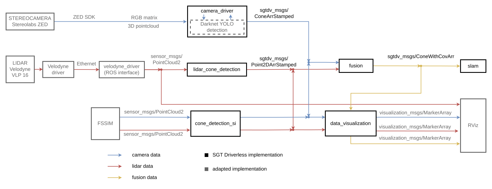

# **Fusion package**

___

&copy; **SGT Driverless**

**Authors:** Juraj Krasňanský, Patrik Knaperek

**Objective:** Fusion of cone detections from camera and lidar.

___

### Related packages
  * [`camera_driver`](../camera_driver/README.md)
  * [`lidar_cone_detection`](../lidar_cone_detection/README.md)
  * [`cone_detection_si`](../simulation_interface/cone_detection_si/README.md)
  * [`data_visualization`](../visualization/data_visualization/README.md)
  * [`measurement_models`](../measurement_models/README.md)
  
### Measurement models

Before running cone detection fusion, we need to know the characteristics of the measurements (measurement models) for camera and lidar. The process of getting measurement models has to be done every time after a significant change in cone detection was made, especially:
  - reality: new sensor, new CNN training in camera cone detection or new position estimation algorithm in lidar cone detection,
  - FSSIM: change in parameters for detections generation (file `sensors_1.yaml`).

For this purpose, use the `measurement_models` package. Move the output stored in `measurement_models/params` to `fusion/params`. **Before launching the fusion package, make sure there are valid configuration files in that folder which match the files included in the fusion launchfile!**

## Compilation

```sh
 $ cd ${SGT_ROOT}/ros_implementation
  $ catkin build path_planning -DCMAKE_BUILD_TYPE=Release
```

### Compilation configuration

* `SGT_Macros.h`:
  - `SGT_EXPORT_DATA_CSV` : export data (camera detections, lidar detections, fused detections, (FSSIM) real cone coordinates) in map frame into folder `fusion/data/`
* `Fusion.h`
  - `VITALITY_SCORE_INIT` : initial value of vitality score
  - `VITALITY_SCORE_MAX` : maximum value of vitality score for cones in database (see Vitality score diagram)
  - `VALIDATION_SCORE_TH` : treshold value of validation score for tracked cone publishing


## Launch
#### **FSSIM**
```sh
  $ source ros_implementation/devel/setup.bash
  $ roslaunch fusion fusion_sim.launch
```
Besides `fusion`, following nodes will be launched:
  - `cone_detection_si` : translantes cone detection messages from FSSIM into the same types as our cone detection nodes publish (see Data flow diagram)
  - `data_visualization` : visualization of detections in RViz

Requires running:
  - [`control_si`](../simulation_interface/control_si/README.md)

#### **Real sensors on RC car**
```sh
  $ source ros_implementation/devel/setup.bash
  $ roslaunch fusion fusion_rc.launch
```
Besides `fusion`, following nodes will be launched:
  - `camera_driver`
  - `lidar_cone_detection`
  <!-- - `visual_odometry` (see [README for `camera_driver`](../camera_driver/README.md)) -->

Requires running:
  - [`robot_localization`](../robot_localization/README.md)
  - [`odometry_interface`](../odometry_interface/README.md)

 Notes:
  - if launching on rosbag data, the `"use_sim_time"` parameter set has to be uncommented
  - transformations from sensor frames to vehicle frame (`base_link`) must be set according to real setup; format: `args="tx ty tz rx ry rz parent_frame child_frame"`
  - transformation from `camera_center` has to have `tz=0`

### Launch configuration
* `fusion_rc.yaml`, `fusion_sim.yaml` :
  - `distance_tolerance` : treshold value of distance [m] between two measurement to be associated
  - `base_frame_id` : vehicle coordinate frame ID
  - `camera/frame_id` : camera detections coordinate frame ID
  - `camera/x_min`: minimum valid x position coordinate for camera detections
  - `camera/x_max`: maximum valid x position coordinate for camera detections
  - `camera/bearing_min`: minimum valid bearing angle for camera detections
  - `camera/bearing_max`: maximum valid bearing angle for camera detections
  - `lidar/frame_id` : lidar detections coordinate frame ID
  - `lidar/x_min`: minimum valid x position coordinate for lidar detections
  - `lidar/x_max`: maximum valid x position coordinate for lidar detections
  - `lidar/y_min`: minimum valid y position coordinate for lidar detections
  - `lidar/y_max`: maximum valid y position coordinate for lidar detections
  - `data_filename` : filename core of exported CSV files
  - `map_frame` : inertial coordinate frame ID


## Diagrams and flowcharts

<figcaption align = "center">Fusion algorithm flowchart</figcaption>
<p align="center">
    
</p>

<figcaption align = "center">Cone detection data flow diagram</figcaption>
<p align="center">
    
</p>

<figcaption align = "center">Fusion message decomposition</figcaption>
<p align="center">
  
</p>

<figcaption align = "center">Vitality score diagram</figcaption>
<p align="center">
  
</p>